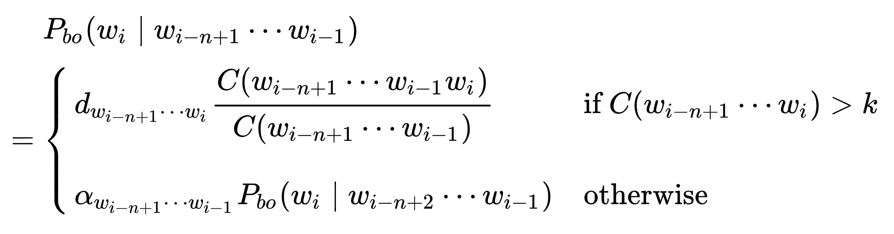
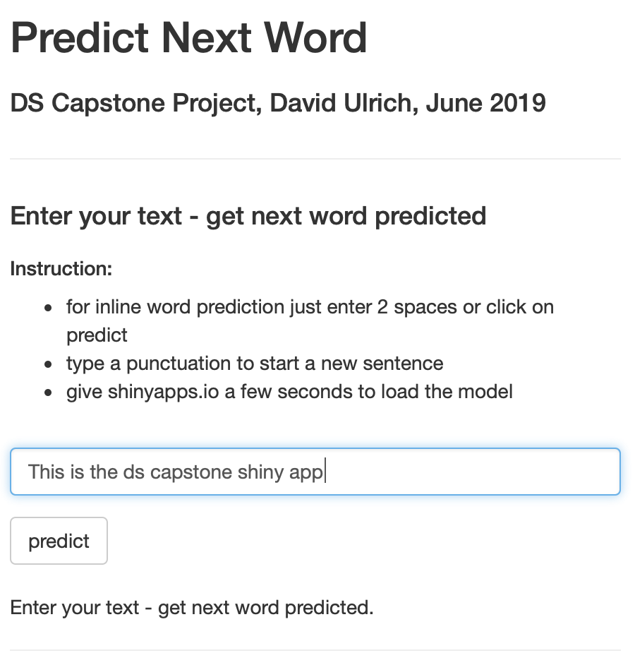

```{r setup, include=FALSE}
knitr::opts_chunk$set(echo = FALSE)
```

## Needed Content

A slide deck consisting of no more than 5 slides created with R Studio Presenter pitching your algorithm and app as if you were presenting to your boss or an investor.

- Does the link lead to a 5 slide deck on R Pubs?
- Does the slide deck contain a description of the algorithm used to make the prediction?
- Does the slide deck describe the app, give instructions, and describe how it functions?
- How would you describe the experience of using this app?
- Does the app present a novel approach and/or is particularly well done?
- Would you hire this person for your own data science startup company?

## The Assignment: Predict Next Word
The Datascience Capstone assignment is to predict the next word based on a model to be trained out of a provided text corpus. The idea of the project is based on the wellknown SwiftKey app.

- Text corpus based on about 600MB of US english news, twitter and blog texts
- Corpus split into train(90%), test(5%) & verification(5%) data
- Corpus cleaned by removal of white space, profanity words, punctuation, numbers, urls etc.
- Basic idea is to train a model on n-grams (4-, 3-, 2- and 1-grams)
- Used Quanteda package to clean corpus and build n-grams
- Improved training efficiency by factors using dpylr package


## Model Building Approaches
During the model building phase, I tried several different approaches

- First tests used TM/RWeka for tokenization and n-gram building, showed to be rather slow --> switched to Quanteda
- First version of model used Stupid Backoff approach without any smoothing. See https://www.aclweb.org/anthology/D07-1090.pdf for details. Works well for large training corpus.
- Next version used the Laplace Add-1 smoothing. But the results didn't improve the prediction rate.
- Tested models with/without stopwords included and models with different minimal counts per stopwords
- Tested all model variants with the same test set of sentence to ensure comparability


## Final Model Approach
For the final model Katz's back-off algorithm with Good-Touring estimation was used:



where C(x) = number of times x appears in training and wi = ith word in the given context

In short Katz's back-Off algorithm backs-off to lower n-1 grams if not found in n grams


## Deployment - Model Tuning
In order to use the model as part of the shiny app, some model tuning (reduction in size) was needed

- Removed all ngrams that end with a stopword as the prediction of a stopword does add much value
- Kept only the ngram/next word combinations with the highest probabilities
- Removed all the 4- and 3-grams which occured only once in the corpus
- Saved ngram tables as RDS files, one file per ngram size (1-4)
--> this resulted in a reduction of the initial model size to less than 200MB

## The Shiny App - Predict Next Word
<div class="columns-2">


Main features 

- loads model on startup
- uses Katz back-off with Good Touring 
- allows a natural typing of text
- provides prediction of the next word on demand
</div>
https://uldi8400.shinyapps.io/David_DSCapstone/


